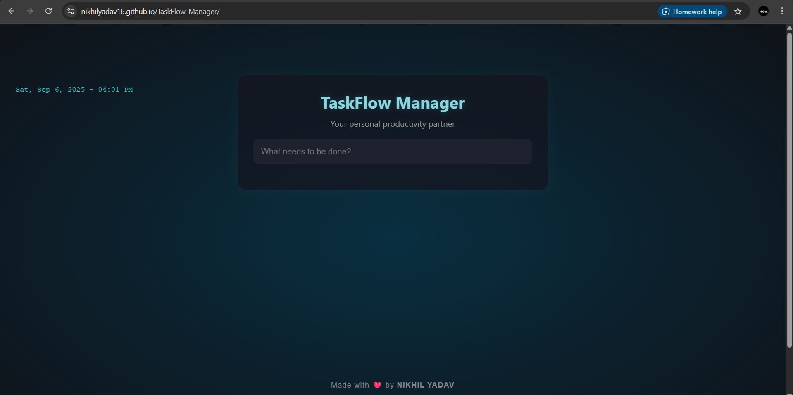

# TaskFlow-Manager

A simple and responsive **To-Do List** web application built with **HTML**, **CSS**, and **JavaScript**. This project helps users keep track of their tasks with the ability to **add**, **delete**, and **mark tasks as completed**.

---

## ✅ Features

- ➕ Add new tasks  
- ❌ Delete tasks  
- ☑️ Mark tasks as completed  
- 🌓 Clean and responsive UI  
- 💾 Local storage support *(optional enhancement)*  

---

## 🚀 Demo

You can view a live version of the project here:  
👉 [Live Demo](https://nikhilyadav16.github.io/TaskFlow-Manager/)

---

## 📁 Project Structure

```
TaskFlow-Manager/
│
├── index.html      # Main HTML structure
├── style.css       # Styles for layout and design
└── app.js          # JavaScript logic for tasks and interactions
```

---

## 🛠️ Technologies Used

- **HTML5**
- **CSS3**
- **JavaScript (ES6)**

---

## 📌 How to Use

1. **Clone the repository**

```bash
git clone https://github.com/nikhilyadav16/TaskFlow-Manager.git
```

2. **Navigate to the project directory**

```bash
cd TaskFlow-Manager
```

3. **Open in your browser**

Open the `index.html` file in any web browser of your choice.

---

## 🖼️ Screenshot



---
